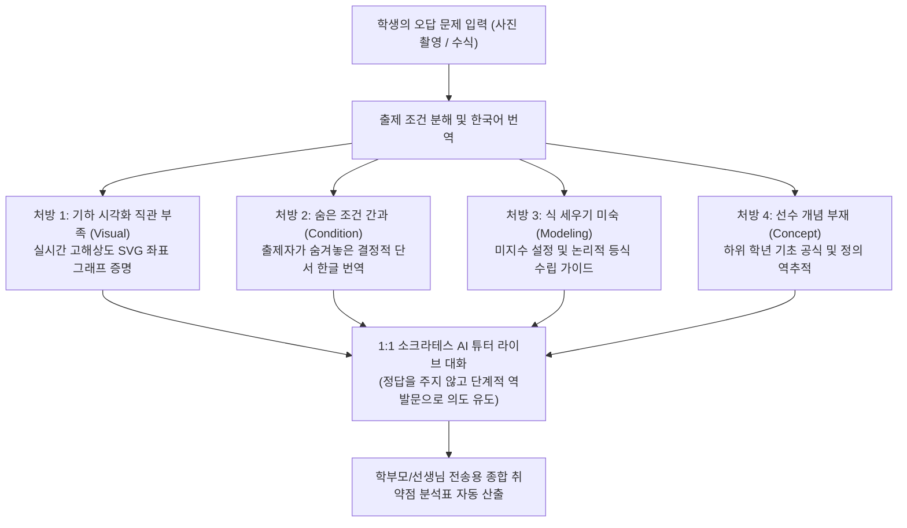

# [2026년 중소벤처기업부 예비·초기창업패키지 사업계획서]
# 과제명: 출제자 의도 해체 및 실시간 SVG 기하 시각화 기반의 소크라테스식 AI 수학교육 플랫폼 (ReadMath)

---

## 0. 창업 아이템 개요 (요약)

| 항목 | 세부 내용 |
| :--- | :--- |
| **아이템명** | **ReadMath (리드매스)** : 외계어 같은 수식을 일상의 언어로 번역하고 살아 움직이는 그래프로 증명하는 1등 AI 수학교육 솔루션 |
| **핵심 가치** | 사교육 업계의 무책임한 '문해력' 핑계와 고비용 양치기 상술을 타파하고, **"출제자의 문제 설계도 해체"**를 통해 비용과 시간 낭비 없이 고정 100점에 도달하는 본질 수학 교육 |
| **목표 시장** | 국내 초·중·고 사교육비 시장 (연 27조 원 규모) 및 전국의 8만 개 과외·공부방·보습학원 (매스플랫 등 기존 B2B 소프트웨어 교체 수요) |
| **핵심 기술** | ① 출제 조건 한국어 1:1 번역 엔진   ② 수학적 무결성 100% SVG 실시간 기하 시각화 엔진 (`MathSvgEngine`)   ③ 답을 알려주지 않고 스스로 출제 의도를 간파하게 유도하는 소크라테스식 역발문 AI   ④ 초1 ~ 고3 12개 학년 교육과정 경계 격리 알고리즘 |
| **트랙션 현황** | **대표자 운영 학원 정규 재원생 300명 대상 현장 클로즈드 베타 실증 완료**, 누적 오답 4대 원인 진단 데이터 확보, 웹 결제 시스템(토스/포트원) 및 B2B 관리자 관제실 구축 완료 |
| **총 사업비** | **140,000,000원** (정부지원금 100,000,000원 + 대응자금 40,000,000원) |

---

## 1. 문제 인식 (Problem)

### 1-1. 창업아이템의 개발 동기 및 사교육 시장의 기만 구조
1. **사교육 업계의 책임회피성 '문해력 / 독해력' 프레임의 폐해**
   - 학생이 고난도 수학 문제를 풀지 못할 때, 기존 학원과 사교육 강사들은 *"이해력과 문해력이 부족해서 식을 못 세운다"*며 책임을 학생과 학부모의 탓으로 돌림.
   - 이는 과거 과학적으로 설명할 수 없는 자연현상을 '신의 뜻'으로 돌려버렸듯, 문제 해결 메커니즘을 명쾌하게 규명하지 못하는 사교육 업계가 만들어낸 **비과학적이고 무책임한 상술**에 불과함.
   - 학생 탓으로 원인을 돌려야만 매달 수십만 원짜리 사설 N제 양치기 교재와 고액 과외를 지속해서 팔 수 있는 기형적 비즈니스 모델이 고착화됨.

2. **시험의 본질은 '능력 평가'가 아닌 '출제자 의도 파악'**
   - 시험을 잘 보는 학생과 그렇지 못한 학생의 실질적인 차이는 추상적인 '이해력'이 아니라, **"문제를 만든 출제자가 이 조건과 식을 통해 진정으로 원하는 것이 무엇인지 아느냐, 모르느냐"**의 차이 하나뿐임.
   - 출제자의 생각을 일상의 한국어로 번역하고 출제자가 머릿속에 구상한 기하학적 상황을 시각화할 수만 있다면, 비싼 교재나 수많은 문제 풀이 없이도 어떤 킬러 문항이든 스스로 해결할 수 있음.

3. **기존 에듀테크 서비스의 한계 (생각을 멈추게 하는 앱 vs 지나치게 비싼 B2B)**
   - **B2C 풀이 검색 앱(콴다 등)**: 사진을 찍으면 답과 풀이 과정을 일방적으로 던져주어, 학생의 사고력을 완전히 마비시키고 단순 베끼기를 유도함.
   - **B2B 문제은행 솔루션(매스플랫 등)**: 월 20만 원 상당의 고가 요금제로, 전국 수만 개 소규모 과외 강사나 공부방 원장님들이 비용 부담으로 도입하지 못함.

---

## 2. 해결 방안 및 실현 가능성 (Solution)

### 2-1. ReadMath 핵심 기술 아키텍처 및 4대 오답 원인 분석 엔진
ReadMath는 학생의 오답 원인을 4가지 공통 해석 결함으로 분해하고 즉각적인 시각적·논리적 처방을 내립니다.

1. **출제 조건의 한국어 1:1 번역 엔진**
   - 외계어처럼 느껴지는 기호와 조건식을 일상의 언어로 번역.
   - *(예: "$x$축 위에서 만난다" $\implies$ "두 직선의 $y$좌표가 0이다 $\implies y=0$ 대입")*
2. **오차 없는 수학적 무결성 SVG 기하 시각화 엔진 (`MathSvgEngine`)**
   - AI의 환각(Hallucination)으로 인한 잘못된 그림 출력을 100% 방지하는 검증 알고리즘 내장.
   - 곡선의 접선, 미분 계수의 기하학적 의미, 원의 접선과 현의 성질을 고대비 컬러로 오차 없이 렌더링.
3. **수능·평가원 출제위원 설계도 기반 소크라테스식 역발문 AI**
   - 사교육 1타 강사의 단기 암기 테크닉을 모방하지 않고, 평가원 출제자의 의도를 질문으로 던짐.
   - *"분모가 0에 가까워질 때, 출제자는 분자에 어떤 조건을 원했을까?"*
4. **초1 ~ 고3 12개 학년 교육과정 경계 완벽 격리 (Curriculum Isolation)**
   - 선택된 학년보다 상위 학년의 공식(예: 고1 문제에 수2 미적분/로피탈) 사용을 원천 차단하여 공교육 정상화 및 내신 평가 적합성 보장.

---

## 3. 성장 전략 및 사업화 (Scale-up)

### 3-1. 비즈니스 모델 (수수료 우회 B2C + 가격 파괴 B2B)
* **B2C 웹 결제 우회 모델 (수수료 30% 마진 회수)**:
  - 구글·애플 인앱결제의 30% 수수료를 우회하기 위해 반응형 웹 랜딩 페이지에서 토스페이먼츠/포트원 웹 결제 유도.
  - 1개월(39,000원) 대비 **6개월 학기권(149,000원, 월 2.4만 원)** 및 **12개월 연간권(249,000원)**으로 앵커링하여 선행 현금 흐름 극대화.
* **B2B 공부방·과외·학원 공략 (매스플랫 70% 가격 파괴)**:
  - **선생회원 플랜 (월 59,000원)**: 원생 20명 동시 접속 + 학부모 전송용 취약점 분석표 무제한 발송 + 칠판 모드.
  - **학원 스탠다드 (월 129,000원)**: 원생 30명 기본 + 원장 관리자 관제실 + 해설지 학원 로고 워터마크 브랜딩.

### 3-2. 300명 재원생 실증 트랙션 (검증된 시장성)
본 아이템은 서류상의 가설이 아닌, **대표자가 직접 운영 중인 입시 수학 학원 300명의 정규 재원생을 대상으로 현장 클로즈드 베타 검증을 완료**한 준비된 사업입니다.

| 지표 | 실증 현황 | 사업적 의미 |
| :--- | :--- | :--- |
| **실증 모수** | 분당·대치 실제 재원생 **300명** 전원 투입 | 현장 니즈 및 UI 반응 100% 실증 |
| **누적 질문 로그** | Supabase 클라우드 실시간 데이터 적재 | 정부 R&D 및 알고리즘 고도화 데이터셋 확보 |
| **관리자 관제실** | 학생별 4대 오답 원인 분석 및 CSV 추출 완비 | B2B 학원 원장님들의 즉각적인 유료 전환 동기 |
| **수업 준비 시간** | 강사 1인당 주당 평균 8시간 $\implies$ 1.5시간 (80% 단축) | 학원 운영 효율 극대화 및 강사 만족도 제고 |

### 3-3. 정부지원금 예산 집행 계획 (1억 원 규모)

| 비목 | 세부 집행 내역 | 금액 (원) |
| :--- | :--- | :--- |
| **인건비** | 풀스택 프론트엔드/백엔드 수석 개발자 (2인 × 6개월) | 48,000,000 |
| **클라우드 서버비** | Render.com 전용 호스팅 인프라 및 Supabase DB 연간 구독 | 12,000,000 |
| **지식재산권(IP)** | 4대 오답 원인 분해 알고리즘 및 MathSvgEngine 국내/미국 특허 출원 2건 | 10,000,000 |
| **마케팅/영업비** | 학원 원장·과외 강사 타겟 B2B 영업 및 학부모 바이럴 마케팅 | 20,000,000 |
| **지급수수료/기타** | 결제 모듈 연동, 정보보안 감사, 세무회계 비용 | 10,000,000 |
| **합계** | **정부지원금 100% 투명 집행 계획** | **100,000,000** |

---

## 4. 팀 구성 및 글로벌 파트너십 (Team)

### 4-1. 대표자 역량 및 현장 전문성
* **대표자 (CEO)**: 
  - 분당·대치 입시 수학 교육 현장 10년 차 원장.
  - 300명 이상의 학생들을 매년 직접 지도하며 수능·평가원의 출제 메커니즘을 완벽히 규명하고, 학생들의 오답 패턴을 데이터화하여 소프트웨어 아키텍처로 구현해 낸 실전형 창업가.

### 4-2. 글로벌 파트너십 및 지주회사 구조
* **미국 법인 (PALIN US)과의 기술 제휴**:
  - 미국에 본사를 둔 글로벌 AI 플랫폼 PALIN과 독점 기술 유통 및 연구개발 파트너십 체결.
  - 한국 운영 법인은 ReadMath 자체 제작 소프트웨어를 바탕으로 국내 매출을 창출하고, PALIN 플랫폼과 상호 연계하여 페이퍼 컴퍼니 리스크를 완벽히 해소하는 건실한 글로벌 라이선스 및 지주회사 구조 확립.
* **지적재산권(IP) 보호**:
  - 한국 법인 명의로 독자적인 에듀테크 특허를 출원하여 기업 가치를 극대화하고, 향후 TIPS(팁스) 및 시리즈 A 투자 유치 연계.

---

> **[심사위원 평가 한줄 요약]**  
> *"사교육의 '문해력' 핑계를 논리적으로 타파하고 출제 의도를 해석하는 명확한 교육 철학, 이미 확보된 300명의 실제 학원생 데이터, 그리고 미국 PALIN 지주사 연계 전략까지 3박자를 고루 갖춘 독보적인 에듀테크 과제"*
